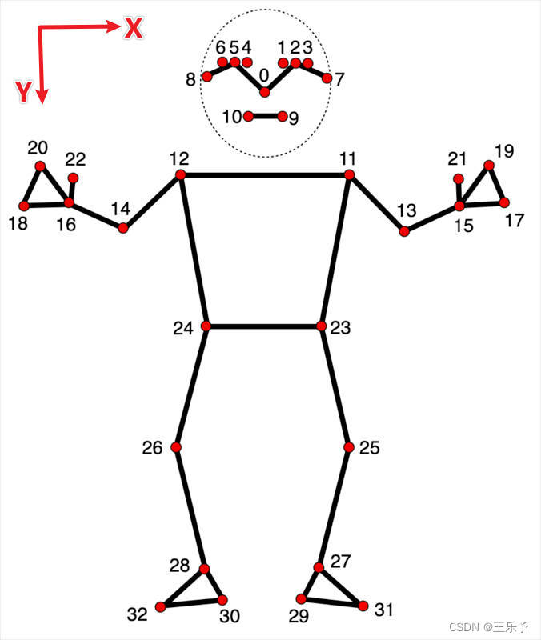
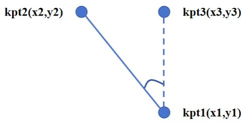

# Sitting-Posture-Detection

## Features

> Using the Google MediaPipe framework
>
> Provide **10** types of poor sitting positions

## Requirements

You can install these dependencies via pip:

```python
pip install -r requirements.txt
```

## Prepare

### Point Information

The pose feature point model tracks the positions of 33 body feature points, representing the approximate positions of the following body parts:





The location information is as follows:


> 0 - nose
> 1 - left eye (inner)
> 2 - left eye
> 3 - left eye (outer)
> 4 - right eye (inner)
> 5 - right eye
> 6 - right eye (outer)
> 7 - left ear
> 8 - right ear
> 9 - mouth (left)
> 10 - mouth (right)
> 11 - left shoulder
> 12 - right shoulder
> 13 - left elbow
> 14 - right elbow
> 15 - left wrist
> 16 - right wrist
> 17 - left pinky
> 18 - right pinky
> 19 - left index
> 20 - right index
> 21 - left thumb
> 22 - right thumb
> 23 - left hip
> 24 - right hip
> 25 - left knee
> 26 - right knee
> 27 - left ankle
> 28 - right ankle
> 29 - left heel
> 30 - right heel
> 31 - left foot index
> 32 - right foot index

### Metric Function




The calculation of internal angles is related to the starting and ending order of the vector. In the above figure, assuming that kpt1 and kpt2 are selected as the two key points of the human body, and kpt3 is the starting point of the vector, which is any point in the vertical direction of kpt1, the included angle is:


$$\theta=\arccos(\frac{\overrightarrow{P_{12}}\times \overrightarrow{P_{13} } } { \left | \overrightarrow{P_{12} } \right | \left |\overrightarrow{P_{13}} \right | } )$$


Let's set the y3 coordinate of kpt3 to 0, and the coordinate values we input include:


$$\theta =\arccos (\frac{y_{1}^{2} - y_{1}\times y_{2}  }{y_{1}\sqrt{(x_{2}-x_{1})^{2}+(y_{2}-y_{1})^{2} } })$$


According to the above figure, $\theta$ is an acute angle. If the vector direction is from kpt2 to kpt1, point kpt3 needs to be marked in the vertical direction of kpt2. At this point, $\theta$ is an obtuse angle.

## Usage


>  - `utils.py`：Definition of metric function and attitude detection function   
>  - `main.py`：Main function, obtain the required key point data, and plot


Running the following code can achieve facial labeling for all people inside the camera:

```python
python main.py
```

## Notice

The judgment indicators in `utils.py` are not fixed, and can only be dynamically adjusted based on the position of the camera to achieve satisfactory results.

## License

This project is licensed under the Apache 2.0 license. For detailed information, please refer to the LICENSE file.

## Acknowledgement

> CSDN: [王乐予-CSDN博客](https://blog.csdn.net/qq_42856191?type=blog)
>
> Google：[Google：pose_landmarker](https://ai.google.dev/edge/mediapipe/solutions/vision/pose_landmarker?hl=zh-cn)
>
> LearnOpneCV: [building-a-body-posture-analysis-system-using-mediapipe](https://learnopencv.com/building-a-body-posture-analysis-system-using-mediapipe/)
